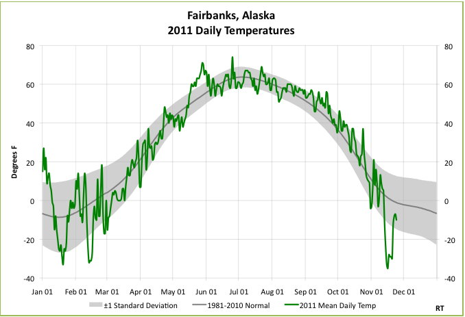

import Assumed from './charts/assumed'
import AssumedMinMax from './charts/assumedMinMax'
import Alternate from './charts/alternate'
import AlternateMinMax from './charts/alternateMinMax'

One thing I like about working at Opentable is that we are strong believers in logging. We log pretty much everything we can with regards to the technical aspects of our sites and apis. This lets us do meaningful analysis in real time and lets us have confidence the performance and correctness of our sites and services.

That said I've had a niggle for a while that something was not quite right. After attending a talk on statistics at Velocity EU I finally realised what it was.

## Timeboxing

We visualise our stats in kibana. Mostly things like the number of requests and average response time. The problem is that we plot these per some unit of time, typically per second. This means that a number of datapoints are colleted together to form a single point on the graph.

It turns out that this is fine if the number of requests you get in a timebox is not too high. The problem is that the api's I work with normally get around 200 requests per second. When dealing with this many requests we can end up losing something in the averages.

For example if I had an average response time of 4 requests per second, In my head I tend to make the assumption that the data that made up that value looks something like:

<Assumed client:load/>

Where the values are in blue and the average is in red. This shows a minor variance around the average. The service could be said to be pretty consistant. The problem is that my data could just as easily have been:

<Alternate client:load/>

In this case my response time is highly inconsistant. In fact most of the time my response time is better than the original graph but I am seeing occasional peaks of high latency yet the average remains the same. This is going to be a problem for my consumers and the more data points you have that make up your timebox the greater the inconsistancies that can go undetected.

For other examples of data that looks the same when averaged look at http://en.wikipedia.org/wiki/Anscombe%27s_quartet

## So how do we fix this?

We need to plot more than just the average. We also plot average +- 1 standard deviation and we could see from that how much our values vary from the average (for those like me who couldn't remember stats standard deviation is explained pretty well here: http://simple.wikipedia.org/wiki/Standard_deviation).

Here's an example of a graph with +- 1 standard deviation on it:

You can see the grey "tunnel" the values sit in. Basically the wider the tunnel the more variance there is in the values. For our requests per second average we want the tunnel to be as thin as possible.

### but...

Kibana does not support plotting standard deviation (apparently it will as of kibana 4 beta 3) so what can we do in the meantime? Instead of plotting just the average we will also plot the max and min values. This is not as good as standard deviation as it will be very succeptible to rogue values. But it will give us something to work with.

My graphs from before with min and max plotted:

<AssumedMinMax client:load/>

<AlternateMinMax client:load/>

We can now clearly see how variant our data is and drive to be as consistant as possible. We do have to be carefull that we break this down per request type though, doing min/max over all requests would be effectively meaningless.

Yay! Stats is cool.
